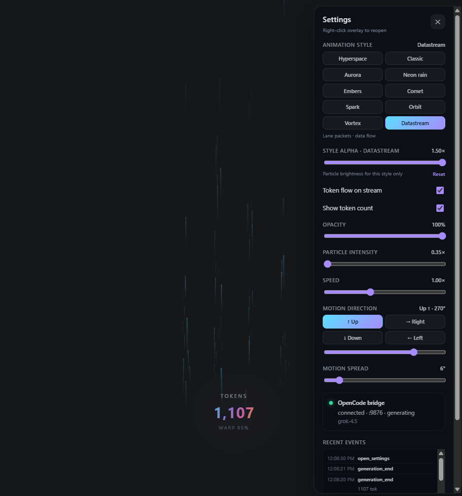

# Agent Overlay for OpenCode

A sleek, transparent desktop overlay that automatically triggers a beautiful **Warp Speed** particle animation when using **[OpenCode](https://opencode.ai/)** — any provider (xAI/Grok, and more).

### ✨ Features

- Auto show/hide animation when OpenCode is generating (any provider: xAI/Grok, …)  
- Canvas particle field: **11 styles** (default **Hyperspace** + **Signal** waves, Datastream, Orbit, …)  
- **Reactive** motion: start kick · idle shimmer · token heartbeat · multi-session tint · completion bloom  
- **Multi-process**: several OpenCode windows at once — overlay stays up until *all* gens end  
- Fully transparent overlay · **does not steal IDE focus** on generation start  
- Works with your existing OpenCode setup (**no extra API key**)  
- **Tauri 2** (Rust) + **Svelte 5** + **Python** bridge (logs + SQLite token poll)  
- Token flow chips · per-style alpha · Windows & macOS  
- Shim/`oc` keep **your project cwd** (OpenCode opens the folder you ran from)  

### 🛠 Tech Stack

- Tauri 2 + Svelte 5 + TypeScript + Vite · Canvas 2D particles  
- Rust (`tiny_http` localhost event server)  
- Python 3 bridge (`opencode_bridge`: detect, emit, log claims, DB poll)  

> ⚠️ Actively developed. Contributions and feedback are welcome!

> **Status:** stable for daily use — OpenCode TUI works normally, particles auto show/hide, no `[EVENT]` spam on chat (logs go to file / settings diagnostics).

### Preview


| Settings panel | Generating (warp particles) |
|:---:|:---:|
|  |  |

- **demo.gif** — End-to-end animation demo  
- **demo-1** — Settings (styles, Style alpha, Token flow, intensity, speed, Test warp)  
- **demo-2** — Transparent overlay, full-bleed particles while generating  

Media: [`assets/media/`](./assets/media/) (mirrors repo `public/`). Full setup guide below.

📖 **Repo README:** [GitHub](https://github.com/sonht113/overlayagent-opencode) · this page is the published guide.

---

## Mục lục / Full guide

1. [Tổng quan](#1-tổng-quan)
2. [Yêu cầu](#2-yêu-cầu)
3. [Setup Windows](#3-setup-windows)
4. [Setup macOS](#4-setup-macos)
5. [Dùng hàng ngày](#5-dùng-hàng-ngày)
6. [Settings overlay](#6-settings-overlay)
7. [Lệnh & API](#7-lệnh--api)
8. [Kiến trúc](#8-kiến-trúc)
9. [Cấu trúc thư mục](#9-cấu-trúc-thư-mục)
10. [Troubleshooting](#10-troubleshooting)
11. [Gỡ cài đặt](#11-gỡ-cài-đặt)

---

## 1. Tổng quan

**Agent Overlay** là cửa sổ desktop trong suốt (Tauri) hiển thị animation particles khi OpenCode đang generate. Có **11 style** (mặc định **Hyperspace**; **Signal** = sóng đồng tâm) và chỉnh **alpha theo style**.

| Trạng thái | Hành vi |
|------------|---------|
| **Idle** | Window **ẩn** — chỉ còn icon tray |
| **Generating** | Window hiện, **chỉ particles** (không cướp focus IDE) — xem [demo-2](./assets/media/demo-2.png) |
| **Multi-gen** | Nhiều process OpenCode cùng lúc → overlay **any-active** (ẩn khi *tất cả* xong) |
| **Settings** | **Right-click** / tray → panel (style, alpha, speed, …) — xem [demo-1](./assets/media/demo-1.png) |

Luồng tự động (Windows / macOS giống nhau):

```text
Login
  → start-overlay (autostart) → tray, window ẩn, HTTP :9876

Terminal (cwd = project của bạn)
  → gõ: opencode   (hoặc oc)
  → shim/oc set PYTHONPATH + AGENT_TOOL_ROOT (không cd tool root)
  → opencode_bridge → OpenCode TUI (thật, đúng project)
  → generate → POST event (+ bridge_pid, session_id) → Overlay particles
  → generation_end (per session) → khi không còn session → fade → ẩn
```

| OS | Install / launcher | Shim |
|----|--------------------|------|
| **Windows** | `*.ps1`, `oc.cmd` | `shim\opencode.cmd` |
| **macOS** | `*.sh`, `oc.sh` | `shim/opencode` |

Env chung: `AGENT_TOOL_ROOT`, `OPENCODE_CMD`, `OPENCODE_REAL`, `TAURI_EVENT_URL`, `OPENCODE_DB` / `OPENCODE_DATA_DIR` / `OPENCODE_LOG_DIR`.

---

## 2. Yêu cầu

| Thành phần | Windows | macOS |
|------------|---------|-------|
| OS | Windows 10/11 (đã test) | macOS 12+ (Apple Silicon / Intel) |
| [Node.js](https://nodejs.org/) 18+ | ✓ | ✓ (`brew install node`) |
| [Rust](https://rustup.rs/) | + MSVC Build Tools | `rustup` + Xcode CLT |
| Python 3.x | `py -3` hoặc `python` | `python3` |
| [OpenCode](https://opencode.ai/) | `npm i -g opencode-ai` | cùng / brew |
| curl | — | có sẵn (health check scripts) |

**Tool root:** clone repo bất kỳ đâu. `oc.ps1` / shim / `start-overlay` resolve root **theo vị trí script** (hoặc `AGENT_TOOL_ROOT`). Không bắt buộc `C:\Work\Tool` — các ví dụ bên dưới dùng path đó chỉ mang tính minh họa.

---

## 3. Setup Windows

Làm **tuần tự**. Sau bước 2–4 nên **đóng hết terminal** rồi mở lại.

### Bước 1 — Build / chạy Overlay

```powershell
# Clone repo rồi cd vào thư mục đó (ví dụ $env:AGENT_TOOL_ROOT)
cd $env:AGENT_TOOL_ROOT\agent-overlay   # hoặc: cd path\to\overlayagent-opencode\agent-overlay
npm install

# Production binary (khuyến nghị cho dùng thật)
npm run tauri build

# Hoặc dev (hot reload, chậm lần đầu)
# npm run tauri dev
```

Thành công: icon **Agent Overlay** trên system tray, window **ẩn**.

Kiểm tra HTTP bridge:

```powershell
Invoke-RestMethod http://127.0.0.1:9876/health
# Kỳ vọng: ok=true, service=agent-overlay, port=9876
```

Nếu chưa có exe release, `start-overlay.ps1` vẫn dùng `target\debug\agent-overlay.exe` nếu đã `tauri dev` / `cargo build` trước đó.

### Bước 2 — PATH shim (`opencode` = monitored)

```powershell
cd C:\Work\Tool
powershell -ExecutionPolicy Bypass -File .\install-shim.ps1
```

Script sẽ:

- Tìm **OpenCode thật** (ưu tiên `…\opencode-ai\bin\opencode.exe`)
- Ghi config: `C:\Work\Tool\.agent-bridge\config.json`
- Bật monitoring: `.agent-bridge\monitoring.enabled`
- Prepend `C:\Work\Tool\shim` (+ Tool root) vào **User PATH**

### Bước 3 — Autostart khi login (khuyến nghị)

```powershell
powershell -ExecutionPolicy Bypass -File .\install-autostart.ps1
```

Optional — thêm daemon giữ overlay sống:

```powershell
powershell -ExecutionPolicy Bypass -File .\install-autostart.ps1 -WithDaemon
```

Tạo shortcut trong thư mục **Startup** của Windows.

### Bước 4 — Profile Warp / PowerShell

```powershell
notepad $PROFILE
```

Thêm:

```powershell
. C:\Work\Tool\profile-snippet.ps1
```

Lưu → **restart Warp / PowerShell**.

Profile cung cấp:

- `oc`, `Start-AgentOverlay`
- `Enable-AgentMonitor` / `Disable-AgentMonitor` / `Get-AgentStatus`
- PATH shim + Tool root trong session

### Bước 5 — Xác nhận

Trong **terminal mới**:

```powershell
where.exe opencode
# Dòng đầu: C:\Work\Tool\shim\opencode.cmd

Get-Content C:\Work\Tool\.agent-bridge\config.json
# opencode_cmd trỏ tới ...\opencode.exe (không phải shim)

Invoke-RestMethod http://127.0.0.1:9876/health

# Mở TUI (phải vào giao diện OpenCode, chat sạch)
opencode
```

---

## 4. Setup macOS

Làm trên MacBook (bash/zsh). Repo path ví dụ: `~/Tool` hoặc clone git.

### 4.1 Dependencies

```bash
# Xcode command line tools (nếu chưa)
xcode-select --install

# Node, Python (Homebrew)
brew install node python rustup
rustup default stable

# OpenCode
npm install -g opencode-ai
# hoặc theo hướng dẫn opencode.ai
```

### 4.2 Build Overlay

```bash
export AGENT_TOOL_ROOT=/path/to/Tool   # thư mục chứa opencode_bridge + agent-overlay
cd "$AGENT_TOOL_ROOT/agent-overlay"
npm install
npm run tauri build
# → …/src-tauri/target/release/bundle/macos/Agent Overlay.app
```

Dev (hot reload):

```bash
npm run tauri dev
```

### 4.3 Shim + PATH

```bash
cd "$AGENT_TOOL_ROOT"
chmod +x start-overlay.sh oc.sh install-shim.sh install-autostart.sh shim/opencode
./install-shim.sh
```

Script sẽ:

- Tìm **OpenCode thật** (PATH, npm global, Homebrew)
- Ghi `.agent-bridge/config.json`
- Thêm `shim` + `AGENT_TOOL_ROOT` vào `~/.zshrc` (hoặc `.bashrc`)

```bash
source ~/.zshrc
which opencode
# …/Tool/shim/opencode
```

### 4.4 Autostart (tuỳ chọn)

```bash
./install-autostart.sh
# LaunchAgent: ~/Library/LaunchAgents/com.agent.overlay.plist
```

### 4.5 Profile helpers (tuỳ chọn)

```bash
# ~/.zshrc
export AGENT_TOOL_ROOT=/path/to/Tool
source $AGENT_TOOL_ROOT/profile-snippet.zsh
```

Helpers: `oc`, `start-agent-overlay`, `enable-agent-monitor`, `get-agent-status`.

### 4.6 Xác nhận

```bash
./start-overlay.sh
curl -s http://127.0.0.1:9876/health
# {"ok":true,"service":"agent-overlay",…}

opencode
# hoặc: ./oc.sh
```

### 4.7 Workaround không install shim

```bash
export AGENT_TOOL_ROOT=/path/to/Tool
export OPENCODE_CMD="$(command -v opencode)"  # binary thật, trước khi prepend shim
cd "$AGENT_TOOL_ROOT"
./start-overlay.sh
python3 -m opencode_bridge run
```

---

## 5. Dùng hàng ngày

### 5.1 Luồng chuẩn

1. Login → overlay chạy nền (tray) nếu đã autostart.  
2. Mở terminal.  
3. Chạy:

```powershell
opencode
```

hoặc:

```powershell
oc
```

4. Làm việc / generate với OpenCode như bình thường (mọi provider).  
5. Overlay **tự hiện** khi generate, **tự ẩn** khi xong.  
6. **Không** còn dòng `[EVENT] …` đè lên ô chat (đã tắt print console).

### 5.2 Phân biệt lệnh

| Lệnh | Ý nghĩa |
|------|---------|
| `opencode` / `oc` | Mở **TUI interactive** (+ monitor overlay) |
| `opencode run "prompt"` / `oc run "prompt"` | Chạy **một prompt** non-interactive |
| `oc "hello"` | OpenCode hiểu `"hello"` là **project path**, **không** phải nội dung chat |

### 5.3 Tray menu

| Mục | Việc |
|-----|------|
| **Show settings** / double-click tray | Hiện window + mở panel settings |
| **Hide overlay** | Ẩn window |
| **Quit** | Thoát app |

### 5.4 Debug verbose (tuỳ chọn)

Mặc định **im lặng** trên console để không phá TUI. Muốn xem log event trên terminal:

```powershell
# Windows
$env:AGENT_BRIDGE_VERBOSE = "1"
opencode
```

```bash
# macOS
export AGENT_BRIDGE_VERBOSE=1
opencode
```

Event vẫn luôn được ghi vào:

- `$AGENT_TOOL_ROOT/.agent-bridge/last_events.jsonl` (Win: `C:\Work\Tool\…`)
- Settings → **Recent events**
- `GET http://127.0.0.1:9876/events`

### 5.5 Test overlay không cần OpenCode

```powershell
# Windows
Invoke-RestMethod -Method POST http://127.0.0.1:9876/event `
  -ContentType "application/json" `
  -Body '{"event":"generation_start","data":{"model":"test","provider":"xai"}}'
```

```bash
# macOS
curl -s -X POST http://127.0.0.1:9876/event \
  -H "Content-Type: application/json" \
  -d '{"event":"generation_start","data":{"model":"test","provider":"xai"}}'
```

Hoặc tray → Show settings → **Test warp**.

---

## 6. Settings overlay

Mở panel: **Right-click** lên overlay (khi đang generate) · tray → **Show settings** · double-click tray.

Settings được **persist** trong `localStorage` (`agent-overlay.settings`) — style, alpha từng style, opacity, intensity, speed, hướng. (Debounce khi kéo slider.)

| Setting | Phạm vi | Mặc định | Ý nghĩa |
|---------|---------|----------|---------|
| **Animation style** | **11** presets | Hyperspace | Kiểu particle field |
| **Style alpha** | 0.15–1.5× | 1× | Độ sáng particle **của style đang chọn** (nhớ riêng từng style) |
| **Token flow on stream** | on/off | **on** | Chip `+N` / total trôi theo particle stream khi token tăng |
| Show token count | on/off | off | Số token tĩnh giữa màn (bổ sung) |
| Opacity | 25–100% | 100% | Độ mờ **shell** (cả cửa sổ) |
| Particle intensity | 0.35–1.5× | 1× | Mật độ / độ mạnh field (kết hợp token) |
| **Speed** | 0.4–2× | 1× | Tốc độ particle |
| **Motion direction** | 0–360° + preset | theo style | Hướng chính (ẩn với style radial) |
| **Motion spread** | 0–60° | theo style | Độ xòe (ẩn với style radial) |
| Test warp | — | — | Bật/tắt animation tay |
| Hide overlay | — | — | Ẩn window (force-idle) |
| Recent events | — | — | Log event gần đây |
| OpenCode bridge status | — | — | Port / model / generating |

**Phân biệt Opacity vs Style alpha**

| Control | Tác động |
|---------|----------|
| Opacity | CSS cả window (mờ toàn shell) |
| Style alpha | Chỉ độ sáng/alpha **particle** style hiện tại |
| Particle intensity | Mật độ + strength field (token-driven) |

### 6.1 Animation styles

| Style | ID | Mô tả | Direction UI |
|-------|-----|--------|--------------|
| **Hyperspace** | `tunnel` | Radial từ tâm, burst lúc start (**default**) | Ẩn (radial) |
| **Signal** | `signal` | Vòng sóng đồng tâm · ambient soft bloom | Ẩn (radial) |
| **Classic** | `streaks` | Streaks theo hướng | Hiện |
| **Aurora** | `aurora` | Cong, glow mềm | Hiện |
| **Neon rain** | `rain` | Mưa dọc, mật độ cao | Hiện (mặc định ↓) |
| **Embers** | `embers` | Tàn lửa bay lên, size to dần | Hiện (mặc định ↑) |
| **Comet** | `comet` | Ít particle, đuôi dài | Hiện |
| **Spark** | `spark` | Nổ ngắn từ nhiều điểm | Ẩn |
| **Orbit** | `orbit` | Vòng quanh tâm | Ẩn |
| **Vortex** | `vortex` | Xoáy bung ra | Ẩn |
| **Datastream** | `datastream` | Làn packet (data flow), soft bloom | Hiện (mặc định →) |

- **Style alpha · {tên}**: chỉnh riêng style đang chọn; nút **Reset** → 1.0×.  
- Datastream / Signal dùng draw “soft” — chỉnh **Style alpha** nếu muốn sáng/tối hơn.  
- Default vẫn **Hyperspace**; chọn **Signal** trong Settings để xem waves.

### 6.1b Reactive behavior (tự động, không cần setting)

| Giai đoạn / sự kiện | Hiệu ứng |
|---------------------|----------|
| **Start** | Burst + intensity kick ~0.55s |
| **0 tokens** (đang gen) | Idle shimmer / breath (field nhẹ hơn full peak) |
| **Token tăng** | Heartbeat intensity; Signal: ring có **cooldown** (không spam) |
| **Nhiều session** | Density + hue tint theo số gen concurrent |
| **End** | Completion bloom (ring ngắn) → fade → ẩn khi không còn session |
| **Stuck session** | Stale TTL ~90s → clear + có thể auto-hide |

### 6.2 Hướng chuyển động (degrees, canvas)

Chỉ áp dụng style **không** ẩn motion (Classic, Aurora, Rain, Embers, Comet, Datastream).  
Radial (không hiện direction): Hyperspace, **Signal**, Spark, Orbit, Vortex.

| Góc | Hướng |
|-----|--------|
| **270°** | ↑ Lên |
| **0°** | → Phải |
| **90°** | ↓ Xuống |
| **180°** | ← Trái |

- Spread **thấp** (6–15°): tia/làn gọn.  
- Spread **cao** (30–45°): tỏa rộng.

Preset nút: **↑ Up / → Right / ↓ Down / ← Left**.

---

## 7. Lệnh & API

### 7.1 CLI bridge (`opencode_bridge`)

Từ repo root (set `PYTHONPATH` hoặc `cd` vào root):

```powershell
# Windows
cd C:\Work\Tool
py -3 -m opencode_bridge status
py -3 -m opencode_bridge enable
py -3 -m opencode_bridge disable
py -3 -m opencode_bridge run
py -3 -m opencode_bridge daemon
```

```bash
# macOS
cd "$AGENT_TOOL_ROOT"
python3 -m opencode_bridge status
python3 -m opencode_bridge enable|disable|run|daemon
```

Profile helpers:

| Windows (`profile-snippet.ps1`) | macOS (`profile-snippet.zsh`) |
|---------------------------------|-------------------------------|
| `Get-AgentStatus` | `get-agent-status` |
| `Enable-AgentMonitor` | `enable-agent-monitor` |
| `Disable-AgentMonitor` | `disable-agent-monitor` |
| `Start-AgentOverlay` | `start-agent-overlay` |
| `oc` | `oc` |

### 7.2 Launcher scripts

| Windows | macOS | Việc |
|---------|-------|------|
| `oc.cmd` / `oc.ps1` | `oc.sh` | Health overlay → bridge run |
| `start-overlay.ps1` | `start-overlay.sh` | Chỉ bật overlay |
| `install-shim.ps1` | `install-shim.sh` | PATH shim |
| `install-autostart.ps1` | `install-autostart.sh` | Login autostart |
| `profile-snippet.ps1` | `profile-snippet.zsh` | Shell helpers |
| `shim\opencode.cmd` | `shim/opencode` | Intercept `opencode` |

### 7.3 Biến môi trường

| Biến | Ý nghĩa |
|------|---------|
| `AGENT_TOOL_ROOT` | Root repo (chứa `opencode_bridge`, `agent-overlay`) |
| `AGENT_BRIDGE_STATE` | Thư mục state (mặc định `$ROOT/.agent-bridge`) |
| `OPENCODE_CMD` / `OPENCODE_REAL` | Binary OpenCode thật |
| `OPENCODE_DB` | Path SQLite OpenCode (override) |
| `OPENCODE_DATA_DIR` | Root data OpenCode (DB/logs parent; auto-detect XDG / LocalAppData) |
| `OPENCODE_LOG_DIR` | Thư mục `*.log` structured logs |
| `TAURI_EVENT_URL` | Mặc định `http://127.0.0.1:9876/event` |
| `AGENT_OVERLAY_HEALTH` | Mặc định `http://127.0.0.1:9876/health` |
| `AGENT_OPENCODE_SHIM_DIR` | Shim dir (strip khỏi PATH child process) |
| `AGENT_BRIDGE_VERBOSE` | `1` = log event ra stderr |
| `AGENT_BRIDGE_FORCE_LOG_TAIL` | `1` = force tail log sớm hơn |

### 7.4 HTTP API (trong process Tauri)

Base: `http://127.0.0.1:9876` (chỉ localhost)

| Endpoint | Method | Mô tả |
|----------|--------|--------|
| `/health` | GET | Liveness |
| `/event` | POST | Nhận event từ monitor |
| `/events` | GET | Ring buffer event (diagnostics) |

**Payload event:**

```json
{
  "event": "generation_start",
  "timestamp": "2026-07-16T00:00:00",
  "data": {
    "provider": "xai",
    "model": "grok-4.5",
    "session_id": "ses_xxx",
    "bridge_pid": 12345
  }
}
```

| `event` | Hành vi overlay |
|---------|-----------------|
| `generation_start` | Track session (`bridge_pid` + `session_id`), show particles, **không setFocus** |
| `tokens_update` | Cập nhật tokens **theo session**; intensity = tổng active; bridge **coalesce** tick |
| `generation_end` | Kết thúc **một** session; ẩn window chỉ khi **không còn** session (fade ~0.9s+, min-visible) |

**Token realtime:** log INFO không còn emit `tokens.*` giữa stream. Bridge poll OpenCode SQLite (message + stream estimate + session delta) ~0.4s khi có `session_id`. Path: `OPENCODE_DB` hoặc `$OPENCODE_DATA_DIR/opencode.db` (mặc định `~/.local/share/opencode/…`).

---

## 8. Kiến trúc

### 8.1 Sơ đồ

```text
┌─────────────────────────────────────────────────────────┐
│  Agent Overlay (Tauri 2 + Svelte 5)                     │
│  • Tray + autostart + single-instance                   │
│  • HTTP 127.0.0.1:9876  (/health /event /events)        │
│  • Canvas: 11 styles + reactive phases + multi-session  │
└──────────────────────────▲──────────────────────────────┘
                           │ POST JSON (+ bridge_pid)
┌──────────────────────────┴──────────────────────────────┐
│  opencode_bridge (Python)                               │
│  • detect: stream start/end (legacy + OpenCode ≥1.15)   │
│  • emit: HTTP (config cache, coalesce tokens) + jsonl   │
│  • runner: TUI inherit + stderr + claimed log tail      │
│  • log_claims / status.bridges[pid] (multi-process)     │
│  • db_tokens: SQLite RO poll                            │
└──────────────────────────▲──────────────────────────────┘
                           │
              shim (opencode.cmd | opencode)  hoặc  oc
              (giữ cwd caller + PYTHONPATH)
                           │
                    OpenCode binary (TUI)
```

### 8.2 Vì sao TUI không bị vỡ

| Sai (cũ) | Đúng (hiện tại) |
|----------|------------------|
| `stdout=PIPE` → OpenCode không vào UI | **stdout/stdin inherit** → TUI đầy đủ |
| `print([EVENT])` đè chat | **Không print** console; log file + overlay panel |
| Binary mơ hồ / shim đệ quy | Ưu tiên **binary thật**; strip shim khỏi PATH child |
| `cd` tool root khi `oc` | **Giữ cwd project** + `PYTHONPATH` / `AGENT_TOOL_ROOT` |

Detect generation:

1. **Start:** legacy `message=stream providerID=… modelID=…` **hoặc** OpenCode ≥1.15 `service=llm` … `stream`  
2. **End:** `exiting loop` / `session.idle` / abort / dispose (session-scoped khi có `session.id`)  
3. **Sources:** stderr (`--print-logs`) + tail log file (claim theo process, dedup)  
4. **Tokens:** poll `opencode.db` (không dựa log `tokens.*` trên INFO)  
5. Bỏ qua `small=true`; mọi `providerID` (xai, aibox, …)

Multi-process:

- `log_claims.json` — mỗi bridge claim 1 log; PID liveness (Windows: không dùng `os.kill` làm probe)  
- `status.json` → `bridges[pid]`  
- Overlay `activeSessions` keyed `pid:session`  

### 8.3 Kill switch

```bash
python3 -m opencode_bridge disable   # hoặc py -3 trên Windows
python3 -m opencode_bridge enable
```

File: `$AGENT_TOOL_ROOT/.agent-bridge/monitoring.enabled` (`1` / `0`).

### 8.4 Cross-platform notes

| Thành phần | Portable? |
|------------|-----------|
| `opencode_bridge` (Python) | Có — `TOOL_ROOT` từ env hoặc script/repo parent |
| Overlay UI (Svelte) | Có — build per OS |
| Tauri tray / transparent | Có — mac cần `macOSPrivateApi` (đã bật) |
| Install / launcher scripts | Tách: `.ps1` Win · `.sh` mac · root **script-relative** |
| OpenCode data paths | `OPENCODE_DATA_DIR` / auto XDG + Windows LocalAppData candidates |

---

## 9. Cấu trúc thư mục

```text
Tool/   (AGENT_TOOL_ROOT — script-relative hoặc env)
├── README.md / README-oc.md
├── public/                     # demo media (README)
│   ├── demo.gif                # Animation demo
│   ├── demo-1.png              # Settings panel
│   └── demo-2.png              # Generating particles
├── docs/                       # GitHub Pages site
│   ├── index.html
│   ├── guide.html
│   ├── content.md
│   └── assets/
├── tests/                      # test_detect, test_log_claim, test_session_keys
├── oc.cmd / oc.ps1 / oc.sh
├── start-overlay.ps1 / .bat / start-overlay.sh
├── install-shim.ps1 / install-shim.sh
├── install-autostart.ps1 / install-autostart.sh
├── profile-snippet.ps1 / profile-snippet.zsh
├── opencode_monitor.py
├── opencode_bridge/            # Python (cross-platform)
│   ├── config.py               # paths, status, log claims, PID liveness
│   ├── runner.py               # TUI + dual feed + claim log
│   ├── detect.py / emit.py / daemon.py / db_tokens.py
├── shim/
│   ├── opencode.cmd / opencode.ps1   # Windows
│   └── opencode                      # macOS / Linux
├── .agent-bridge/              # config, status, log_claims, last_events
└── agent-overlay/              # Tauri app
    ├── src/                    # Svelte + particles
    └── src-tauri/
```

---

## 10. Troubleshooting

| Triệu chứng | Cách xử |
|-------------|---------|
| `where`/`which opencode` không ra shim | Chạy lại `install-shim` (.ps1 / .sh), **mở terminal mới** |
| Chỉ in path rồi thoát, không vào TUI | Binary thật trong `config.json`; không pipe stdout |
| Vào TUI nhưng **chat bị đè `[EVENT]`** | Quiet default; tắt `AGENT_BRIDGE_VERBOSE` |
| Generate nhưng **không có particles** | Health `:9876`; tray còn sống? `enable` monitoring? |
| Overlay không tự bật | `start-overlay` + `install-autostart` |
| Path OpenCode sai | Sửa `opencode_cmd` trong `.agent-bridge/config.json` |
| Python không chạy | Win: `py -3`; Mac: `python3` |
| Hai instance overlay | Single-instance: lần 2 mở settings |
| Port 9876 bận | Tắt process overlay; hoặc đổi port (khớp URL monitor) |
| Mac: không tìm thấy `.app` | `cd agent-overlay && npm run tauri build` |
| Mac: transparent/tray lạ | Đã bật `macOSPrivateApi`; thử `tauri dev` log |
| Win/Mac: đổi UI nhưng bản cũ | `npm run tauri build` + **Quit** tray rồi mở lại release |
| **Signal** “không thấy” | Settings → chọn **Signal** (default vẫn Hyperspace) |
| 2 OpenCode · overlay ẩn sớm / lộn session | Cần bridge multi-session; xem `log_claims.json` + `bridge_pid` |
| Overlay **kẹt** sau gen | Tray **Hide**; stale session TTL ~90s; restart overlay |
| Log/token miss (đặc biệt Win) | `OPENCODE_LOG_DIR` / `OPENCODE_DATA_DIR` / `OPENCODE_DB`; `AGENT_BRIDGE_VERBOSE=1` |
| `oc` mở **sai project** | Cập nhật shim/oc (giữ cwd); không `cd` tool root |
| Unit tests bridge | `python3 -m tests.test_detect` · `test_log_claim` · `test_session_keys` |

### Kiểm tra nhanh health + event log

```powershell
Invoke-RestMethod http://127.0.0.1:9876/health
Invoke-RestMethod http://127.0.0.1:9876/events
Get-Content $env:AGENT_TOOL_ROOT\.agent-bridge\last_events.jsonl -Tail 10
py -3 -m opencode_bridge status
```

```bash
curl -s http://127.0.0.1:9876/health
tail -10 "$AGENT_TOOL_ROOT/.agent-bridge/last_events.jsonl"
python3 -m opencode_bridge status
```

---

## 11. Gỡ cài đặt

```powershell
# Windows (từ repo root)
powershell -File .\install-shim.ps1 -Uninstall
powershell -File .\install-autostart.ps1 -Uninstall
# Tray → Quit
# Remove-Item -Recurse .\.agent-bridge
```

```bash
# macOS
./install-shim.sh --uninstall
./install-autostart.sh --uninstall
# Tray → Quit
# rm -rf "$AGENT_TOOL_ROOT/.agent-bridge"
```

Gỡ dòng `source …/profile-snippet` trong shell profile nếu đã thêm.

---

## Dev overlay (developer)

```bash
cd agent-overlay
npm install
npm run tauri dev    # hot reload UI
npm run check
# Sau khi đổi particles/UI cho bản cài đặt:
npm run tauri build  # rồi Quit tray + mở lại Agent Overlay.app / exe
# start-overlay ưu tiên release bundle — không hot-reload bản release
```

| File | Việc |
|------|------|
| `src/lib/particles/config.ts` | Tunables `WARP` + reactive/signal |
| `src/lib/particles/presets.ts` | **11** styles + palette / softBloom |
| `src/lib/particles/ParticleSystem.ts` | Engine spawn/update/draw · phases · rings |
| `src/lib/stores/generation.svelte.ts` | activeSessions, style alpha, localStorage |
| `src/lib/components/SettingsPanel.svelte` | UI settings |
| `src/lib/bridge/opencode.ts` | Listen Tauri events · show/hide |
| `src-tauri/src/event_server.rs` | HTTP `:9876` |
| `opencode_bridge/*` | detect / emit / runner / claims |

Chi tiết app: [`agent-overlay/README.md`](./agent-overlay/README.md).
